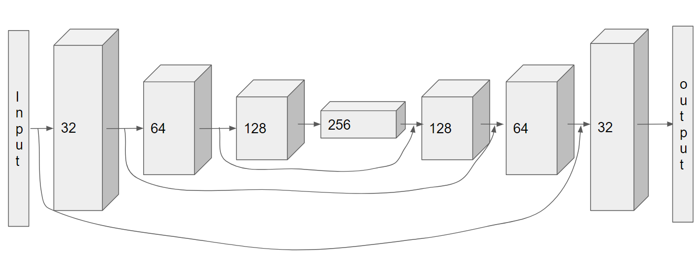
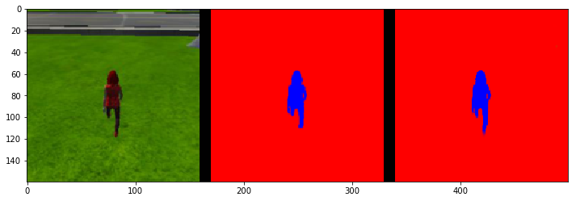
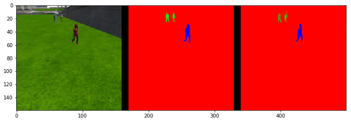
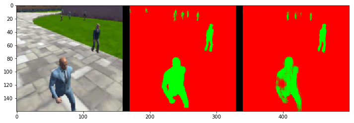

# Project Follow me

## Steps to complete the project:
Clone the project repo [here](https://github.com/udacity/RoboND-DeepLearning-Project)
Fill out the TODO's in the project code in the code/model_training.ipynb file.
Optimize your network and hyper-parameters.
Train your network and achieve an accuracy of 40% (0.4) using the Intersection over Union IoU metric.
Make a brief write-up report summarizing why you made the choices you did in building the network.
## Project Specification
[here](https://review.udacity.com/#!/rubrics/1155/view) are Rubric points for this project.

## writeup
### Introduction
This write up is based on the Udacity Robotics software engineer term1 project "Follow Me".

### Network architecture
In this project, I used the following model. This model is called the encoder-decoder model, and it is known to be effective in the area of ​​image segmentation. The most famous architecture is [U-Net](https://lmb.informatik.uni-freiburg.de/people/ronneber/u-net/), but this time I got the result I wanted without using a complicated architecture.

 1. InputLayer:**IN** 160x160x3, **OUT** 160x160x3
 2. SeparableConv2D:**IN** 160x160x3, **OUT** 80x80x32
 3. BatchNorm:**IN** 80x80x3, **OUT** 80x80x3
 4. SeparableConv2D:**IN** 80x80x32, **OUT** 40x40x64
 5. BatchNorm:**IN** 40x40x64, **OUT** 40x40x64
 6. SeparableConv2D:**IN** 40x40x64, **OUT** 20x20x128
 7. BatchNorm:**IN** 20x20x128, **OUT** 20x20x128
 8. Conv2D:**IN** 20x20x128, **OUT** 20x20x256
 9. BatchNorm:**IN** 20x20x256, **OUT** 20x20x258
 10. BilinearUpSampling2D:**IN** 20x20:256, **OUT** 40x40x256
 11. Concatnate:**IN** 10 and 5, **OUT** 40x40x320
 12. SeparableConv2D:**IN** 40x40x320, **OUT** 40x40x128
 13. BatchNorm:**IN** 40x40x128, **OUT** 40x40x128
 14. BilinearUpSampling2D:**IN** 40x40x128, **OUT** 80x80x128
 15. Concatnate:**IN** 14 and 3, **OUT** 80x80x160
 16. SeparableConv2D:**IN** 80x80x160, **OUT** 80x80x64
 17. BatchNorm:**IN** 80x80x64, **OUT** 80x80x64
 18. BilinearUpSampling2D:**IN** 80x80x64, **OUT** 160x160x64
 19. Concatnate:**IN** 18 and 1, **OUT** 160x160x67
 20. SeparableConv2D:**IN** 160x160x67, **OUT** 160x160x32
 21. BatchNorm:**IN** 160x160x32, **OUT** 160x160x32
 22. Conv2D:**IN** 160x160x32, **OUT** 160x160x3

### Training and network hyperparameters
 In the training phase, the most important thing is the adjustment of hyperparameters. Initially, if you use [hyperopt](https://github.com/hyperopt/hyperopt), [GridSearchCV](http://scikit-learn.org/stable/modules/generated/sklearn.model_selection.GridSearchCV.html), etc. for parameter adjustment, you can decide the value exhaustively and objectively, but in this project, I did not do because of the training time of train FCN.
 I will explain about hyperparameters.
 First, learning_rate, I tried 0.005, 0.0015 and 0.001. The higher number of learning_rate is more likely to converge, but the lower learning_rate will take more time to learn. I tried the above numbers, finally decided to 0.005.
 Next is epoch, which is determined by how many times does it need for converges of learning. Once I tried the epoch=10, but it could not get the objective score, so I add ten times epoch, and then I could get actual scores.
 For other parameters, batch_size, workers, steps, I decided them based on my GPU.

### Techniques in this project
#### CNN basics
We use the convolution layers in each. Convolutional Layers often used in the area of ​​image processing.  The concept of Convolutional layers is it squash the image size with filters and expand the features to the depth channel. Connecting the Convolutional layers in every and add Softmax in the tail, it is the Convolutional Neural Network(=CNN). It is good for recognize 'Is this a hot dog?', However, it can not do 'Where is a hot dog?'. This matter based on that the CNN does not have spacial information in it.
To improve this matter, we can use the additional two techniques. By combining them, it is called the Fully Convolutional Networks(=FCN).

#### FCN and 1-by1 convolutions
  The FCN can reserve the spacial information in it. The first technique is the 1-by-1 convolutional layer. FCN have the 1-by-1 convolutional layer in the bottom. The output of the previous layer of the 1-by-1 convolutional layer is the same size as kernels of the last layer; so, the spacial information is on the list of the (1, n)
  size output (n=kernel_number). So the next layer of the 1-by-1 convolutional layer can take the spacial information from the output of the 1-by-1 convolutional layer. And the most important thing about 1-by-1 convolutional layer is that it can reduce the output dimensions to the number of 1-by-1 convolutional filters. To reduce the dimension can be good like more squeeze the features.

#### Encoders - Decoder
  The mechanism of encoding is that first, the input is an image and input it to the Convolutional layer. The features are consolidated by convolutional filters. Through the all convolutional layers, the output is the essential items, primal elements or unit in the image like that. In this case, it is connected 1-by-1 convolutional layer, and the output of 1-by-1 convolutional layer connect to the decoder block.
  The most important concept of decoding is Upsampling. The upsampling is to make the output expand with consolidated features. And finally, after the last decoder layer, there is a convolutional output layer with softmax activation to create the pixel-wise segmentation image.

#### General techniques
Here is the especially technique of FCN's. Also, we use the essential technology of learning with DNN.
The batch normalization layer normalizes the variation of data in the batch, and learning can be advanced quickly. The skew of the data in each batch will occur the learning loss in each batch and make it slow in the total learning because the model needs to adjust to each skew. So, it is good for the learning that the skew of the data in each batch reduced, and we should use batch normalization to decrease this issue.
Separable (Depthwise) The convolution layer calculates the channel and the spatial position separately, and combination it to reduce the computational time.

### Result
The dataset of this project is downloaded from [Here](https://classroom.udacity.com/nanodegrees/nd209/parts/09664d24-bdec-4e64-897a-d0f55e177f09/modules/cac27683-d5f4-40b4-82ce-d708de8f5373/lessons/197a058e-44f6-47df-8229-0ce633e0a2d0/concepts/06dde5a5-a7a2-4636-940d-e844b36ddd27)
 * following_images : Images recognizing targets to follow.
 * patrol_with_targ : Images that we recognize including targets that follow and others.
 * patrol_non_targ : Image with no target.

 * following_images  
 

 * patrol_with_targ  
 

 * patrol_non_targ  
 

Finally, I can get 0.41 score on my trial.

### Question from reviewer
`This rubric point needs a little more work.
Indeed the encoding layer detects features, Why do we name it "encoder".
Encoding, in general, means compressing with or without loss of information.`
 * Which case have we got here?  
 In this case we can use encoder unit to image segmentation.
 * Do we lose information?  
Yes, we lose information.
 * Which information do we lose?  
The detail of image, e.g. if we use max-pooling, the output is only max value. So, we lose the value is not max.
 * Which information does the decoder recover  
 The decoder recover the information which is the strong features of the image in this case. It is because the input data of decoder layer is squeezed by the encoder layers.

`This rubric point is not fully addressed in your write-up. To address it just answer the following questions`

 * Can the network model as we trained it to be used to track another object?  
 No, because the ground truth data is not same in that situations.
 * if no, should we change the network? data? both?  
 Change the Data is most suitable for this case. Because in my trial the network can also detect the non-hero targets, hence the network depth or width to express this game world's object is enough.

`Fully convolutional network (FCN) is different from fully connected layer (FCL).
 Tip : FCL is similar to 1x1 convolution. But there is a slight difference between them.
 Please explain both and state the difference between them.`
 FCN consist on the convolutional layers in each layer, on the other side FCL is the layer which has just a node to fully connect. The difference of them is the layer type to get output.

### Future improvement
 * The resolution of the image should be more high, e.g., the size of the image, and the quality of the image.
 * It is better to increase the dataset if you want to get more robustness in the other situation.
 * To improve the model, we need to use automatic hyperparameter optimization because the tuning is not quantitative.
 * To apply this model to the other objects we need to change the ground truth data of the target. If the size of the object does not change, then we can use same model architecture.

### Trained Weights
[here](https://github.com/romth777/RoboND-DeepLearning-Project/tree/master/data/weights)
